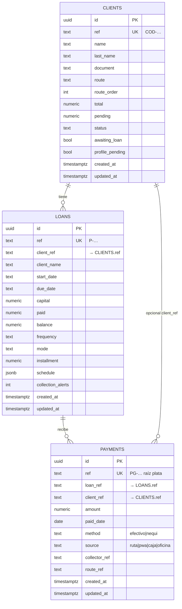
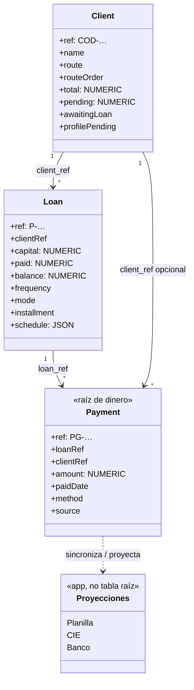

# Esquema Supabase — operativo (claro y manejable)

**Proyecto:** `connkdwezlwqlwgjerav`  
**Estado:** C5 endurecido — tres tablas raíz + vistas de lectura  
**Dinero:** siempre `NUMERIC`, nunca float  
**App:** dual-write / pull desde `apps/admin` (`payment-mirror`, `catalog-mirror`)

---

## Diagrama ER (entidad–relación)

---

## Diagrama UML (clases / dominio)

---

## Quién manda

| Tabla | Clave negocio | Manda en |
| --- | --- | --- |
| `clients` | `COD-…` | Ficha, ruta, orden |
| `loans` | `P-…` | Condiciones del préstamo |
| `payments` | `PG-…` | **Toda la plata** |

Proyecciones (aún no tablas raíz): planilla, CIE, banco → se calculan en la app desde `PG-`.

Vistas SQL de apoyo: `v_loans_enriched`, `v_payments_enriched` (solo lectura).

---

## Migraciones (orden)

1. `20260912150000_payments.sql` — crea `payments` + RLS  
2. `20260912160000_clients_loans.sql` — crea `clients` + `loans` + RLS  
3. `20260912210000_schema_harden_ops.sql` — checks, índices, triggers `updated_at`, vistas

---

## Convenciones

- **refs** con prefijo: `COD-` / `P-` / `PG-` (CHECK en SQL)
- **Dinero:** `numeric(14,2)`
- **Tiempo de fila:** `created_at` / `updated_at` (UTC, trigger en UPDATE)
- **RLS:** `authenticated` + `anon` temporal (quitar anon en C6 con auth real)
- **Sin FK físicas aún** entre tablas: el dual-write puede llegar desordenado; la relación es lógica (`client_ref`, `loan_ref`). FK estrictas = C6.

---

## Qué toca la app

| Acción | Tabla |
| --- | --- |
| Cobrar | `payments` (+ actualiza espejo `loans` / `clients`) |
| Alta/edita cliente | `clients` |
| Alta/edita/renueva préstamo | `loans` |

localStorage = caché + cola offline. Postgres manda al hacer pull.

---

## Siguiente endurecimiento (C6)

1. Auth Supabase + RLS por rol (quitar `anon`)  
2. FK `loans.client_ref → clients.ref` y `payments.loan_ref → loans.ref`  
3. Fechas `date` puras (hoy parte sigue en texto demo)  
4. Tablas de proyección opcionales: `day_closes`, `routes` si dejan de ser solo local
