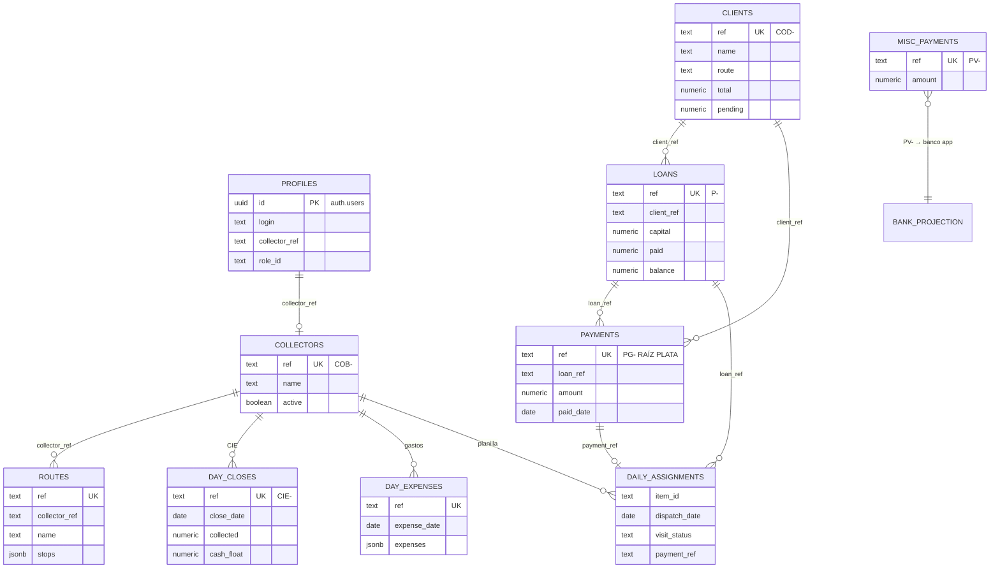
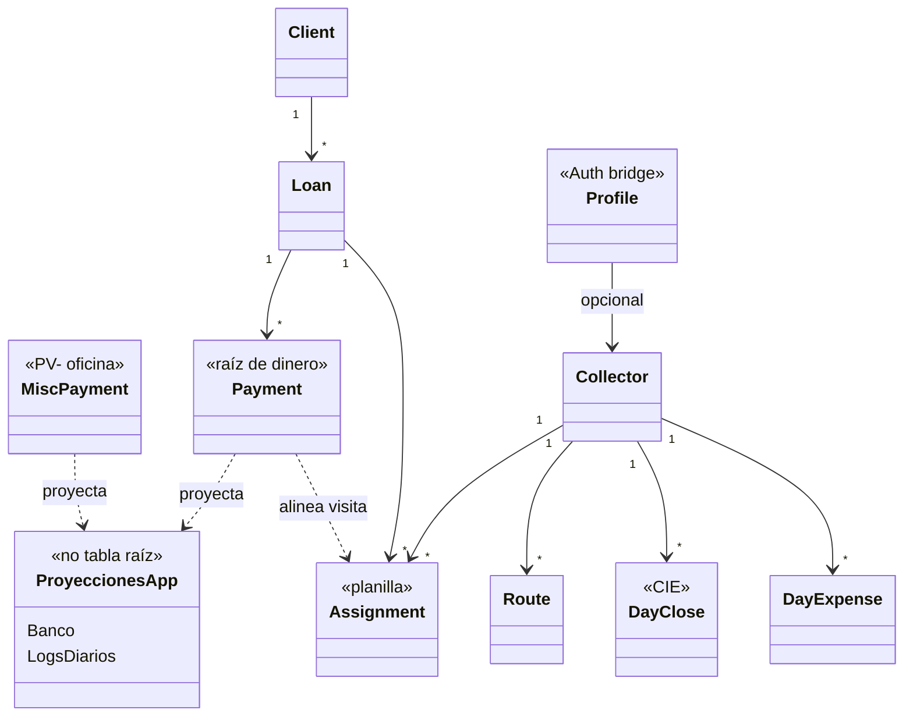

# Esquema Supabase — dominio completo (nivel alto)

**Proyecto:** `connkdwezlwqlwgjerav`  
**Estado:** C6 foundation — catálogo + dinero + CIE + planilla + perfiles  
**Dinero:** `NUMERIC` · **App:** mirror/pull (`payment-mirror`, `catalog-mirror`, `ops-mirror`)

---

## Diagrama ER completo

---

## UML dominio

---

## Quién manda (nada suelto)

| Capa | Tablas | Rol |
| --- | --- | --- |
| Personas | `clients` | COD- |
| Contratos | `loans` | P- |
| **Plata** | `payments` | **PG- raíz** |
| Campo | `collectors`, `routes` | COB- / RUT- |
| Jornada | `day_closes`, `day_expenses` | CIE- / gastos |
| Planilla | `daily_assignments` | visitas del día |
| Oficina | `misc_payments` | PV- |
| Auth | `profiles` | uid → login / rol |
| Proyección app | — | Banco + logs desde PG- + CIE + PV- |

---

## Migraciones

1. `…150000_payments.sql`  
2. `…160000_clients_loans.sql`  
3. `…210000_schema_harden_ops.sql`  
4. `…220000_ops_complete.sql` ← dominio completo + `v_ops_overview`

---

## Sync en la app

| Módulo | Código |
| --- | --- |
| Cobros | `payment-mirror` |
| Clientes / préstamos | `catalog-mirror` |
| Ops (CIE, rutas, …) | `ops-mirror` + `/api/ops/*` |
| Orquestación | `useOperationalDemoSync` |

---

## Siguiente (C6.1)

1. Usuarios Auth para cada cobrador + filas en `profiles`  
2. Quitar políticas `anon`  
3. FK físicas tras backfill  
4. Realtime en `payments` / `day_closes`
